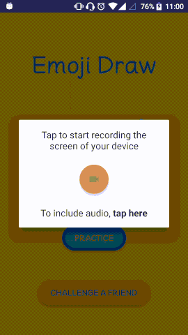

# EMOJI DRAW

A fun game where you are asked to draw emojis as accurately as possible
so that Google's AI can guess what you are drawing.

## Background 

In [summer 2017](https://www.theverge.com/2017/6/12/15743130/google-gboard-android-update-keyboard-emoji-ai),
Google added to its Gboard keyboard an emoji recognition feature: it allows users to draw an emoji
and then displays the closest matches (based on a image recognition algorithm), so that the user can pick
the one that they intended to use. Here's what it looks like:

The image recognition algorithm is available online, via an undocumented API. (*TODO missing reference here to the Medium article*)
 has analyzed and documented the API. With the help of this resource, I was able to get access to the API, 
 and then I came up with the idea of turning the emoji recognition into a game.
 
 
 ## Objective of the game
 
 You are given the description of an emoji (in text) and you are asked to draw it. As you draw, the 
  game displays to you the 10 first guesses that Google's AI has made about what emoji are drawing. 
  The aim is to have the requested emoji be the first guess of the AI. When this happens, 
  you are presented with a new emoji to draw. Can you draw 10 emojis in 60 seconds?
 
 
 
 
The gif above can be found as a video [here](https://youtu.be/yQKhzzBO0A0).
 
 
## For recruiters

This project is available as open-source and the code (and scope of the app) in this branch has been
 adjusted to serve for recruitment processes (as an alternative to custom per-client assignments).
  
### Requirements
  
  - The player gets 60 sec to draw a set of 10 emojis, randomly selected.
  - When time is up, the player "loses" and cannot continue.
  - The player can clear the canvas and start the drawing from the beginning, or just undo the latest stroke drawn.
  - For each stroke that the user adds to the drawing, we make a call to the image recognition API
  and display the first 10 results.
  - If the requested emojis is included in the 10 guesses, it should flash or pulse, to draw the player's
  attention to it, and a tooltip should be shown, pointing at that guess and explaining to the user
  that this must be the first guess.
  - If the user draws all 10 emojis on time, a congratulations message is shown.
  - The user can skip an emoji (who knows how to draw the zodiac signs anyway...) but if they do,
  the congratulations message should acknowledge that the player has "cheated".
  
  
### What this project is not about
  
  This project is about functionality, code quality and fun. It's not about UI or UX. There are aspects
  that have been purposely left out to be simple, while it's clear that they do not offer the best user experience.
  Hopefully this project will make it to Google Play, and if this happens, both the scope and the UX
  will be different. 
  As for the UI, it was designed by me, a color-blind engineer with poor design skills,
  although I have to say that the result is not that bad as other things that I've designed. It even
  has some reasoning behind it, taken from 
  [this article](https://medium.com/google-design/redesigning-android-emoji-cb22e3b51cc6) 
  that explains how the new Android Oreo emojis were designed.
  And no, the font is not Comic Sans (but it's cheesily similar).
  
  
### What this project IS about
  
  - Architecture
  - Clean code
  - Animations and transitions
  - Testing
  
  The project uses a layered architecture, with MVP on the presentation layer, and is highly reactive. 
  Code organization is based on package-by-feature (although the app as it stands has just one main feature).
   
  The project includes a number of cool features and demonstrates knowledge and experience with various 
  techniques and aspects of Android development.
   
   
   **Libraries:**
   The project uses a number of libraries from the standard toolbox of an Android developer: Support
   libraries, Retrofit, Dagger2, RxJava, AutoValue, Butterknife, DiffUtil etc. 
   
   **Custom Views:**
   The app defines a number of custom views, that are stylable through custom attributes, like 
  `DrawingView`, `DrawingViewWithControls`, `EmojiTimer` and `CutePopup`. The Views are also made reactive and 
  expose Observables rather than using callbacks.
       
   
   **Animations and transitions:**
  A number of animations are shown off in the app, like the pulse animation inside the RecyclerView,
  or the "win" grow and fade in animation when the player gets an emoji right. 
  `PracticeActivity` enters and exits with custom transitions. 
   
   
  **Gesture detection:**
   The drawing component demonstrates ability to detect and handle touch gestures.
   
   
  **Responsive design:**
  The UI was designed for large screens, but can be adapted to smaller devices as well, with the use
  of appropriate resource qualifiers.
 
 
  **Custom drawing and view manipulation:**
  Displaying the tooltip pointing to the correct element of the RecyclerView was a quite challenging 
  task (I wanted to have it as decoupled as possible from the RecyclerView, and not include it to the 
  layout of the item). Getting this correct included some run-time measurements and cool calculations.
  
  
  **Build variants:**
  The main game should select the emojis randomly. This complicates development: sometimes we just want
   to have simple emojis to draw (so that we can test the win case), or just test specific emojis.
  For this reason, we have defined 3 different variants that basically differ in the way that the emojis
  that the player has to draw are provided. *Standard* selects emojis randomly (the default case). *Fixed*
   uses a preselected selection of emojis. *Sequential* can be used to iterate all emojis in order.
  
  
### Testing
 
 The project comes with a number of tests. The app was not developed with real TDD (since 
 there was not a clear vision from the beginning of what the app would look like at the end) and these tests
 are not supposed to be a full test-suite. They just try to show the various types of testing on Android
 that I have experience with.
 
 **JDK tests:** 
 MVP allows us to test the view logic in isolation, by testing the Presenter, which is completely
 decoupled from the Android SDK. See `PracticePresenter`. The Presenter's dependencies are mocked
 with Mockito.
 
 **UI tests:**
 We have included some UI tests, that test only one aspect of the UI (the popup windows). The UI tests
  are based on Espresso and leverage the Dagger2 capabilities to create a specific component for 
  testing, that is then used to inject a stub Presenter to the view, which has a predetermined behavior.
  
 **Other tests:**
  `RandomEmojiToDrawProviderTest` is a unit test of the `RandomEmojiToDrawProvider` that requires to 
  be run  on an emulator or on a device (since it reads a file from the assets), so it's included in `androidTest`
  `EmojiDetectionProvideTest` is an exploratory, non-automated test, whose purpose is just to help
  us explore the remote API.
 
 
# TODO list
 
 - Proguard
 - Tutorial on 1st execution and on demand
 - Intro animation