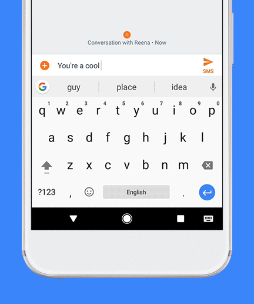
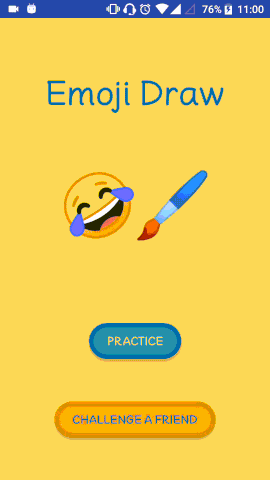

# EMOJI DRAW

A fun game where you are asked to draw emojis as accurately as possible
so that Google's AI can guess what you are drawing.

## Background 

In [summer 2017](https://www.theverge.com/2017/6/12/15743130/google-gboard-android-update-keyboard-emoji-ai),
Google added to its Gboard keyboard an emoji recognition feature: it allows users to draw an emoji
and then displays the closest matches (based on a image recognition algorithm), so that the user can pick
the one that they intended to use. Here's what it looks like:

The image recognition algorithm is available online, via an undocumented API. (*TODO missing reference here to the Medium article*)
 has analyzed and documented the API. With the help of this resource, I was able to get access to the API, 
 and then I came up with the idea of turning the emoji recognition into a game.
 
 
 ## Objective of the game
 
 You are given the description of an emoji (in text) and you are asked to draw it. As you draw, the 
  game displays to you the 10 first guesses that Google's AI has made about what emoji are drawing. 
  The aim is to have the requested emoji be the first guess of the AI. When this happens, 
  you are presented with a new emoji to draw. Can you draw 10 emojis in 60 seconds?
 

 
 
The gif above can be found as a video [here](https://youtu.be/rqQcz5UT8mg).
